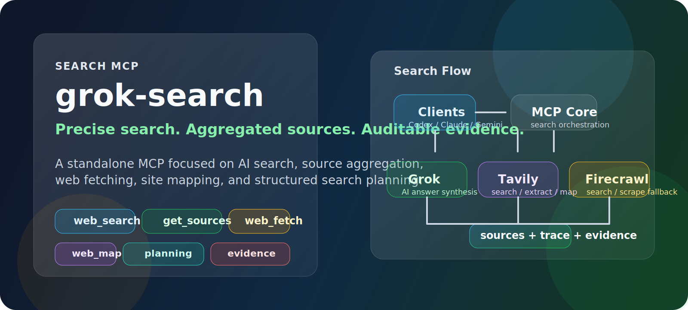
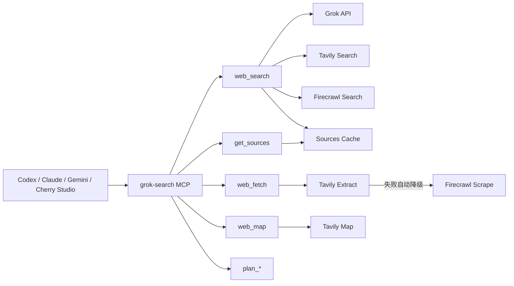
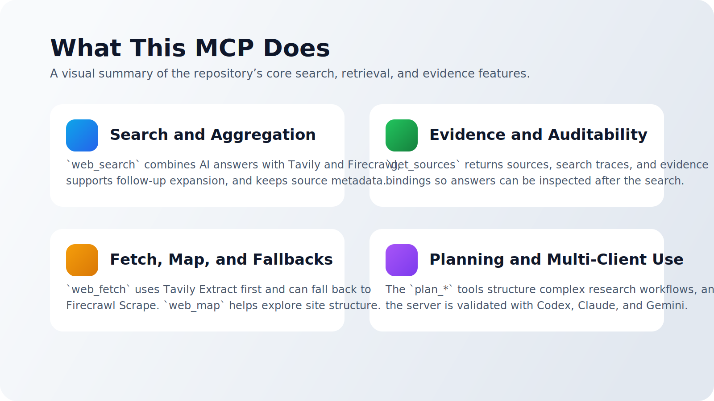

<div align="center">

[English](./docs/README_EN.md) | 简体中文

**独立的搜索 MCP 工具，专注于精准搜索、聚合搜索、网页抓取与证据组织。**

[](./LICENSE)
[](https://www.python.org/downloads/)
[](https://github.com/jlowin/fastmcp)
[](#工具概览)
[](#客户端接入)

</div>

---

## 项目定位

`grok-search` 是一个基于 [FastMCP](https://github.com/jlowin/fastmcp) 的 **搜索 MCP 服务器**。它的目标不是做通用 agent 框架，而是把以下能力稳定地封装成可复用工具：

- `web_search`：AI 搜索 + 多源聚合
- `get_sources`：信源、搜索轨迹、证据绑定
- `web_fetch`：网页内容抓取
- `web_map`：站点结构映射
- `plan_*`：复杂搜索前的结构化规划

> 说明：本项目是 **独立的搜索 MCP 工具**，与 `cccc`、`webcoding` 无任何关联。

## 上游与维护

- 当前维护与发布：`ysjzy123`
- 上游项目与原始作者：[`GuDaStudio/GrokSearch`](https://github.com/GuDaStudio/GrokSearch/tree/grok-with-tavily) 的 `grok-with-tavily` 分支，作者 `GuDaStudio`
- 维护说明：本仓库是在上游基础上继续整理、修复和发布的独立仓库
- 详细署名见：[AUTHORS.md](./AUTHORS.md)

## 为什么是这版

这版仓库重点强调几个清晰的改进方向：

- 更稳：输入校验、模型切换校验、错误显式返回、流式失败 fallback
- 更全：`web_search` 支持预算内多轮聚合与来源补充，默认 `extra_sources=20`
- 更准：`get_sources` 返回 `search_trace` 与 `evidence_bindings`，方便审计结论与来源
- 更可用：`Claude / Codex / Gemini` 三端均已验证可接入
- 更可维护：增加回归测试、工作流文档和开发验证说明

## 架构



## 核心能力

| 能力 | 当前实现 |
|------|----------|
| 精准搜索 | 条件时间上下文注入、模型校验、流式失败自动回退 |
| 聚合搜索 | Grok + Tavily + Firecrawl 的预算内聚合 |
| 来源组织 | `sources`、`search_trace`、`evidence_bindings` |
| 网页抓取 | Tavily Extract 优先，Firecrawl Scrape 托底 |
| 站点映射 | Tavily Map，适合文档站与仓库入口探索 |
| 复杂问题规划 | `plan_intent` 到 `plan_execution` 六阶段 |
| 持久化缓存 | `get_sources` 支持跨进程恢复 |
| 多客户端接入 | 已验证 `Codex`、`Claude`、`Gemini` |



## 项目优势

这版项目的优势不在于“包装更多概念”，而在于把搜索 MCP 真正常用的环节补齐了：

- 搜索结果更可审计：
  - `web_search` 返回答案
  - `get_sources` 返回来源、搜索轨迹、证据绑定
- 聚合能力更完整：
  - 支持 Grok、Tavily、Firecrawl 组合使用
  - 默认补充额外来源，减少单一回答带来的信息盲区
- 复杂问题更可控：
  - 提供六阶段 `plan_*` 工具，适合复杂检索前先做拆解
- 抓取链路更稳：
  - `web_fetch` 优先 Tavily Extract，失败再降级到 Firecrawl Scrape
- 客户端接入更直接：
  - 已验证 `Codex`、`Claude`、`Gemini`

## 本地验证

以下结果来自 **2026-04-09** 的本地回归与真实环境验收。

### 自动化结果

| 项目 | 结果 |
|------|------|
| 回归测试 | `22 passed` |
| 真实环境检查 | 已完成 |
| 多客户端接入 | `Codex / Claude / Gemini` |
| gating failures | `0` |

### 如何复现

```bash
uv run --with pytest --with pytest-asyncio pytest -q
```

## 安装

### 前置条件

- Python 3.10+
- [uv](https://docs.astral.sh/uv/getting-started/installation/)
- 至少一个 OpenAI 兼容的 Grok 接口
- 可选：Tavily / Firecrawl

### 从你的 Fork 安装

如果你把这份代码推到自己的仓库，建议保留 `grok-with-tavily` 分支，这样可以直接用：

```bash
uvx --from git+https://github.com/<yourname>/GrokSearch@grok-with-tavily grok-search
```

如果你是长期维护者，更推荐安装为本地工具：

```bash
uv tool install --from git+https://github.com/<yourname>/GrokSearch@grok-with-tavily grok-search
```

### 本地开发安装

```bash
git clone https://github.com/<yourname>/GrokSearch.git
cd GrokSearch
git checkout grok-with-tavily
uv tool install -e .
```

### 关键环境变量

| 变量 | 必填 | 默认值 | 说明 |
|------|------|--------|------|
| `GROK_API_URL` | 是 | - | OpenAI 兼容 Grok API 地址 |
| `GROK_API_KEY` | 是 | - | Grok API Key |
| `GROK_MODEL` | 否 | `grok-4.20-beta` | 默认模型 |
| `TAVILY_API_URL` | 否 | `https://api.tavily.com` | Tavily 地址 |
| `TAVILY_API_KEY` | 否 | - | Tavily Key |
| `TAVILY_ENABLED` | 否 | `true` | 是否启用 Tavily |
| `FIRECRAWL_API_URL` | 否 | `https://api.firecrawl.dev/v2` | Firecrawl 地址 |
| `FIRECRAWL_API_KEY` | 否 | - | Firecrawl Key |
| `GROK_DEBUG` | 否 | `false` | 调试开关 |
| `GROK_RETRY_MAX_ATTEMPTS` | 否 | `3` | 最大重试次数 |
| `GROK_RETRY_MULTIPLIER` | 否 | `1` | 重试退避乘数 |
| `GROK_RETRY_MAX_WAIT` | 否 | `10` | 最大等待秒数 |

## 客户端接入

### Claude Code

```bash
claude mcp add-json grok-search --scope user '{
  "type": "stdio",
  "command": "uvx",
  "args": [
    "--from",
    "git+https://github.com/<yourname>/GrokSearch@grok-with-tavily",
    "grok-search"
  ],
  "env": {
    "GROK_API_URL": "https://your-grok-endpoint/v1",
    "GROK_API_KEY": "your-grok-key",
    "TAVILY_API_URL": "https://api.tavily.com",
    "TAVILY_API_KEY": "your-tavily-key",
    "TAVILY_ENABLED": "true",
    "FIRECRAWL_API_URL": "https://api.firecrawl.dev/v2",
    "FIRECRAWL_API_KEY": "your-firecrawl-key"
  }
}'
```

### Codex

`~/.codex/config.toml` 示例：

```toml
[mcp_servers.grok-search]
type = "stdio"
command = "/home/yourname/.local/bin/grok-search"

[mcp_servers.grok-search.env]
GROK_API_URL = "https://your-grok-endpoint/v1"
GROK_API_KEY = "your-grok-key"
TAVILY_API_URL = "https://api.tavily.com"
TAVILY_API_KEY = "your-tavily-key"
TAVILY_ENABLED = "true"
FIRECRAWL_API_URL = "https://api.firecrawl.dev/v2"
FIRECRAWL_API_KEY = "your-firecrawl-key"
```

### Gemini CLI

`~/.gemini/settings.json` 示例：

```json
{
  "mcpServers": {
    "grok-search": {
      "command": "/home/yourname/.local/bin/grok-search",
      "args": [],
      "env": {
        "GROK_API_URL": "https://your-grok-endpoint/v1",
        "GROK_API_KEY": "your-grok-key",
        "TAVILY_API_URL": "https://api.tavily.com",
        "TAVILY_API_KEY": "your-tavily-key",
        "TAVILY_ENABLED": "true",
        "FIRECRAWL_API_URL": "https://api.firecrawl.dev/v2",
        "FIRECRAWL_API_KEY": "your-firecrawl-key"
      }
    }
  }
}
```

## 工具概览

当前共暴露 **13 个 MCP 工具**：

### 搜索与抓取

- `web_search`
- `get_sources`
- `web_fetch`
- `web_map`

### 诊断与控制

- `get_config_info`
- `switch_model`
- `toggle_builtin_tools`

### 搜索规划

- `plan_intent`
- `plan_complexity`
- `plan_sub_query`
- `plan_search_term`
- `plan_tool_mapping`
- `plan_execution`

## 搜索设计原则

这版实现遵循几个明确的原则：

1. **先给答案，再给可审计来源**
   - `web_search` 返回回答
   - `get_sources` 返回来源、轨迹、证据绑定

2. **默认允许聚合，但不做无限扩展**
   - 默认 `extra_sources=20`
   - 宽泛问题可以 follow-up
   - 简单问题不会无限 fan-out

3. **事实性回答尽量建立在多来源上**
   - Grok 提供综合答案
   - Tavily / Firecrawl 补结构化来源
   - `evidence_bindings` 尽量把 claim 对齐到更具体的 source

4. **抓取链路必须有托底**
   - Tavily Extract 失败后自动降级到 Firecrawl Scrape

5. **复杂搜索先规划，再执行**
   - `plan_*` 六阶段专门用于复杂研究类问题

## 开发与验证

### 安装依赖

```bash
uv sync
```

### 运行测试

```bash
uv run --with pytest --with pytest-asyncio pytest -q
```

### 关键文件

| 路径 | 用途 |
|------|------|
| `src/grok_search/server.py` | MCP 工具入口与主流程 |
| `src/grok_search/providers/grok.py` | Grok provider |
| `src/grok_search/sources.py` | 来源缓存与来源拆分 |
| `tests/test_regressions.py` | 回归测试 |
| `docs/improvement-workflow.md` | 改进与验收工作流 |

## FAQ

### 为什么默认 `extra_sources=20`？

因为这版项目的目标是“更完整的聚合搜索”，而不是只依赖单一 Grok 回答。默认来源补充可以提升覆盖面与来源可审计性。

### 我不想用默认模型怎么办？

可以用 `switch_model` 持久化切换，也可以在 `web_search` 单次调用时显式指定 `model`。

### 可以直接迁移到新电脑吗？

可以。最稳的方式是把当前仓库推到你自己的 Git 仓库，然后在新机器上使用：

```bash
uv tool install --from git+https://github.com/<yourname>/GrokSearch@grok-with-tavily grok-search
```

### 这是不是通用 agent 框架？

不是。它是一个专注于搜索、聚合、抓取与搜索规划的 MCP 工具集。
