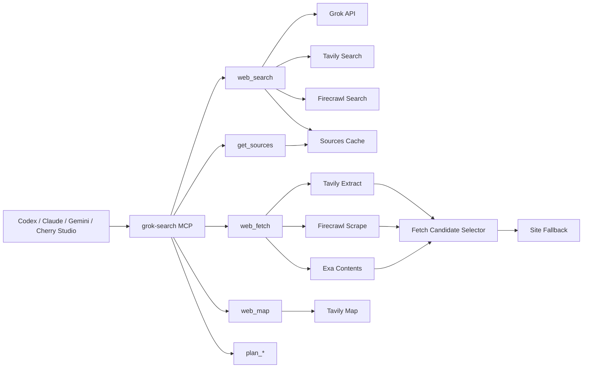

<div align="center">

English | [简体中文](../README.md)

**A standalone search MCP focused on precise search, aggregation, web fetching, and evidence organization.**

[](../LICENSE)
[](https://www.python.org/downloads/)
[](https://github.com/jlowin/fastmcp)
[](#tools)
[](#client-setup)

</div>

---

## What This Project Is

`grok-search` is a [FastMCP](https://github.com/jlowin/fastmcp) server built for one job: **search better**.

It provides:

- `web_search` for AI search plus multi-source aggregation
- `get_sources` for sources, search trace, and evidence bindings
- `web_fetch` for page extraction
- `web_map` for site discovery
- `plan_*` tools for structured search planning

> Note: this repository is a **standalone search MCP**. It is not related to `cccc` or `webcoding`.

## Upstream And Maintenance

- Current maintainer and publisher: `ysjzy123`
- Upstream project and original author: [`GuDaStudio/GrokSearch`](https://github.com/GuDaStudio/GrokSearch/tree/grok-with-tavily), branch `grok-with-tavily`, author `GuDaStudio`
- Maintenance note: this repository continues from the upstream project as a separately maintained and released repository

## Why This Version

This version focuses on a few concrete improvement areas:

- more robust validation
- explicit error surfacing
- streaming fallback
- more robust fetching through multi-candidate selection, low-quality shell detection, Exa support, and site-specific fallbacks
- persistent source cache
- richer source metadata
- search trace and evidence bindings
- verified client support for `Codex`, `Claude`, and `Gemini`

## Architecture



## Key Capabilities

| Capability | Current Implementation |
|-----------|------------------------|
| Precise search | time-context injection only when needed, model validation, streaming fallback |
| Aggregation | Grok + Tavily + Firecrawl under a bounded search budget |
| Source auditability | `sources`, `search_trace`, `evidence_bindings` |
| Web fetching | Tavily / Firecrawl / Exa multi-candidate selection with low-quality shell detection and site fallback |
| Site discovery | Tavily Map |
| Complex research | six planning tools from `plan_intent` to `plan_execution` |
| Persistent cache | `get_sources` survives process restarts |
| Multi-client support | validated with `Codex`, `Claude`, `Gemini` |


## Strengths

The strength of this project is not “more layers of framing”, but a cleaner end-to-end search MCP experience:

- more auditable search results:
  - `web_search` returns the answer
  - `get_sources` returns sources, trace, and evidence bindings
- stronger aggregation:
  - combines Grok, Tavily, and Firecrawl
  - extra sources are enabled by default to reduce single-answer blind spots
- better handling of complex questions:
  - the six `plan_*` tools support structured decomposition
- more robust retrieval:
  - `web_fetch` collects Tavily / Firecrawl / Exa candidates in parallel
  - it filters low-quality shell pages before selecting a winner
  - it adds site-specific fallbacks for Reddit / Zhihu / Juejin
- easier client adoption:
  - validated with `Codex`, `Claude`, and `Gemini`

## Local Validation

The latest local wrap-up snapshot on this branch is **2026-04-23**.

### Automated Results

| Item | Result |
|------|--------|
| `tests/test_regressions.py` | `49 passed` |
| `tests/test_compare_versions.py` | `3 passed` |
| Multi-client validation | `Codex / Claude / Gemini` |
| live benchmark | not re-run in this round; use the commands below |

### Reproduce

```bash
uv run --with pytest --with pytest-asyncio pytest -q
uv run python scripts/compare_versions.py
uv run python scripts/compare_versions.py --include-live --benchmark-file benchmarks/web_fetch_real_urls.txt
```

## Installation

### Requirements

- Python 3.10+
- [uv](https://docs.astral.sh/uv/getting-started/installation/)
- at least one OpenAI-compatible Grok endpoint
- optional: Tavily / Firecrawl / Exa

### Install From Your Fork

If you keep the `grok-with-tavily` branch in your own fork:

```bash
uvx --from git+https://github.com/<yourname>/GrokSearch@grok-with-tavily grok-search
```

For long-term usage, installing as a tool is more stable:

```bash
uv tool install --from git+https://github.com/<yourname>/GrokSearch@grok-with-tavily grok-search
```

### Local Editable Install

```bash
git clone https://github.com/<yourname>/GrokSearch.git
cd GrokSearch
git checkout grok-with-tavily
uv tool install -e .
```

### Important Environment Variables

| Variable | Required | Default | Description |
|----------|----------|---------|-------------|
| `GROK_API_URL` | Yes | - | OpenAI-compatible Grok endpoint |
| `GROK_API_KEY` | Yes | - | Grok API key |
| `GROK_MODEL` | No | `grok-4.20-fast` | default model |
| `TAVILY_API_URL` | No | `https://api.tavily.com` | Tavily endpoint |
| `TAVILY_API_KEY` | No | - | Tavily key |
| `TAVILY_ENABLED` | No | `true` | enable Tavily |
| `FIRECRAWL_API_URL` | No | `https://api.firecrawl.dev/v2` | Firecrawl endpoint |
| `FIRECRAWL_API_KEY` | No | - | Firecrawl key |
| `EXA_API_URL` | No | `https://api.exa.ai` | Exa endpoint |
| `EXA_API_KEY` | No | - | Exa key |
| `EXA_ENABLED` | No | `true` | enable Exa |
| `GROK_DEBUG` | No | `false` | debug mode |
| `GROK_RETRY_MAX_ATTEMPTS` | No | `3` | max retry attempts |
| `GROK_RETRY_MULTIPLIER` | No | `1` | retry multiplier |
| `GROK_RETRY_MAX_WAIT` | No | `10` | max retry wait seconds |

## Client Setup

### Claude Code

```bash
claude mcp add-json grok-search --scope user '{
  "type": "stdio",
  "command": "uvx",
  "args": [
    "--from",
    "git+https://github.com/<yourname>/GrokSearch@grok-with-tavily",
    "grok-search"
  ],
  "env": {
    "GROK_API_URL": "https://your-grok-endpoint/v1",
    "GROK_API_KEY": "your-grok-key",
    "TAVILY_API_URL": "https://api.tavily.com",
    "TAVILY_API_KEY": "your-tavily-key",
    "TAVILY_ENABLED": "true",
    "FIRECRAWL_API_URL": "https://api.firecrawl.dev/v2",
    "FIRECRAWL_API_KEY": "your-firecrawl-key",
    "EXA_API_URL": "https://api.exa.ai",
    "EXA_API_KEY": "your-exa-key",
    "EXA_ENABLED": "true"
  }
}'
```

### Codex

Example `~/.codex/config.toml`:

```toml
[mcp_servers.grok-search]
type = "stdio"
command = "/home/yourname/.local/bin/grok-search"

[mcp_servers.grok-search.env]
GROK_API_URL = "https://your-grok-endpoint/v1"
GROK_API_KEY = "your-grok-key"
TAVILY_API_URL = "https://api.tavily.com"
TAVILY_API_KEY = "your-tavily-key"
TAVILY_ENABLED = "true"
FIRECRAWL_API_URL = "https://api.firecrawl.dev/v2"
FIRECRAWL_API_KEY = "your-firecrawl-key"
EXA_API_URL = "https://api.exa.ai"
EXA_API_KEY = "your-exa-key"
EXA_ENABLED = "true"
```

### Gemini CLI

Example `~/.gemini/settings.json`:

```json
{
  "mcpServers": {
    "grok-search": {
      "command": "/home/yourname/.local/bin/grok-search",
      "args": [],
      "env": {
        "GROK_API_URL": "https://your-grok-endpoint/v1",
        "GROK_API_KEY": "your-grok-key",
        "TAVILY_API_URL": "https://api.tavily.com",
        "TAVILY_API_KEY": "your-tavily-key",
        "TAVILY_ENABLED": "true",
        "FIRECRAWL_API_URL": "https://api.firecrawl.dev/v2",
        "FIRECRAWL_API_KEY": "your-firecrawl-key",
        "EXA_API_URL": "https://api.exa.ai",
        "EXA_API_KEY": "your-exa-key",
        "EXA_ENABLED": "true"
      }
    }
  }
}
```

## Tools

This repository currently exposes **13 MCP tools**.

### Search and Retrieval

- `web_search`
- `get_sources`
- `web_fetch`
- `web_map`

### Diagnostics and Control

- `get_config_info`
- `switch_model`
- `toggle_builtin_tools`

### Search Planning

- `plan_intent`
- `plan_complexity`
- `plan_sub_query`
- `plan_search_term`
- `plan_tool_mapping`
- `plan_execution`

## Search Design Principles

This version follows a few explicit rules:

1. **Answer first, then auditability**
   - `web_search` returns the answer
   - `get_sources` returns sources, trace, and evidence bindings

2. **Aggregation by default, not unlimited expansion**
   - default `extra_sources=20`
   - broader questions may trigger follow-up expansion
   - simple questions do not fan out indefinitely

3. **Prefer multi-source support for factual claims**
   - Grok provides the synthesized answer
   - Tavily / Firecrawl add structured supporting sources
   - `evidence_bindings` tries to align claims to more specific sources

4. **Fetching must have selection and fallback paths**
   - `web_fetch` collects Tavily / Firecrawl / Exa candidates in parallel
   - it filters obvious shell pages before selection
   - it applies site-specific fallbacks for Reddit / Zhihu / Juejin when needed

5. **Complex research should be planned**
   - the six `plan_*` tools exist for that purpose

## Development

### Install Dependencies

```bash
uv sync
```

### Run Tests

```bash
uv run --with pytest --with pytest-asyncio pytest -q
```

### Compare Against Baseline And Run Live Checks

```bash
uv run python scripts/compare_versions.py
uv run python scripts/compare_versions.py --include-live
uv run python scripts/compare_versions.py --include-live --benchmark-file benchmarks/web_fetch_real_urls.txt
```

### Real-URL `web_fetch` Benchmark

```bash
uv run python scripts/benchmark_web_fetch.py \
  --url-file benchmarks/web_fetch_real_urls.txt \
  --json-out benchmarks/live_fetch_benchmark_result.json
```

To keep raw provider outputs for manual review, add:

```bash
uv run python scripts/benchmark_web_fetch.py \
  --url-file benchmarks/web_fetch_real_urls.txt \
  --json-out benchmarks/live_fetch_benchmark_result.json \
  --artifact-dir benchmarks/live_fetch_artifacts
```

### Key Files

| Path | Purpose |
|------|---------|
| `src/grok_search/server.py` | MCP entrypoints and main flow |
| `src/grok_search/providers/grok.py` | Grok provider |
| `src/grok_search/sources.py` | source cache and source parsing |
| `scripts/compare_versions.py` | baseline comparison and deterministic/live score runner |
| `scripts/benchmark_web_fetch.py` | real-URL multi-provider benchmark for `web_fetch` |
| `benchmarks/web_fetch_real_urls.txt` | default real URL sample set |
| `tests/test_regressions.py` | regression tests |
| `docs/improvement-workflow.md` | improvement and acceptance workflow |

## FAQ

### Why is `extra_sources=20` the default?

Because this version aims to be an aggregation-oriented search MCP rather than a thin wrapper around a single Grok answer.

### Can I move this to a new machine directly?

Yes. The most reliable path is to push this repo to your own Git repository and install from that fork:

```bash
uv tool install --from git+https://github.com/<yourname>/GrokSearch@grok-with-tavily grok-search
```

### How does `web_fetch` choose the final output now?

By default it fetches Tavily Extract, Firecrawl Scrape, and Exa Contents in parallel.

Then it:

1. detects low-quality shell pages
2. selects among non-low-quality candidates using content strength plus provider preference
3. falls back to site-specific recovery when blocked domains need extra handling

Built-in site-specific handling currently exists for `Reddit`, `Zhihu`, and `Juejin`.

### Which files under `benchmarks/` should be committed?

Normally keep only:

- `benchmarks/web_fetch_real_urls.txt`
- any benchmark notes you intentionally want to preserve long-term

Normally do not commit generated outputs such as:

- `benchmarks/live_fetch_artifacts*/`
- `benchmarks/live_*.json`

### Is this a general agent framework?

No. It is a search-focused MCP toolkit for search, aggregation, fetching, and search planning.
